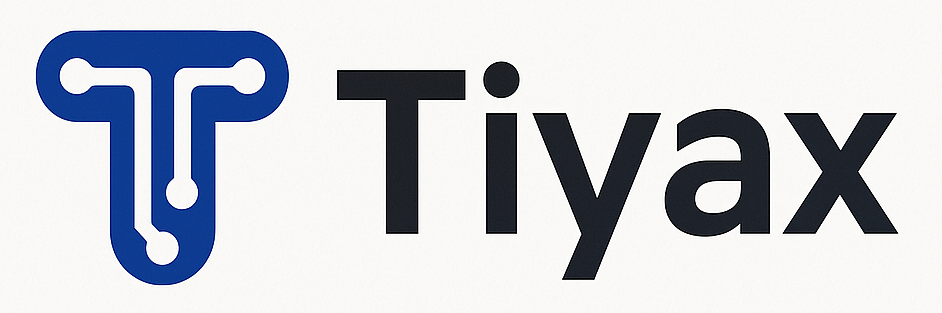

# 🔥 Tiyax — The Reactive, Modern & Real-Time PHP Framework

**Tiyax** is a next-generation PHP framework designed to bring PHP into the era of **real-time**, **reactivity**, and **native state synchronization**, without relying on external dependencies like Node.js.

> Inspired by the Kikongo word for **“fire”**, Tiyax embodies **speed**, **lightness**, and **power** for modern web development.

---

## 🚀 Why Tiyax?

Today’s leading PHP frameworks (like Laravel, Symfony) are powerful but still based on the traditional **request-response model**. In a world driven by **dynamic, real-time, interactive** web apps, PHP lacks a **truly native reactive engine**.

Tiyax is built to solve that gap:

- 🔄 **Reactive server-side controllers** without complex JavaScript
- 📡 **Native WebSockets** or equivalent, powered purely by PHP
- 🧠 **Centralized application state**, synced between client & server
- ⚡ **Dynamic views** that auto-update based on state changes
- 🧩 **Modular & extensible** by design
- 🔒 **Secure by default**, tailored for real-time architectures

---

## 🧠 Technical Vision

Tiyax is not just another Laravel clone — it’s a bold proposal to **evolve the PHP ecosystem** into a more reactive and modern territory:

| Feature | Description |
|--------|-------------|
| 🎛️ Reactive Controllers | Respond to real-time events in PHP |
| 🖥️ Dynamic Views | Auto-updating interfaces from server state |
| 🧬 State Sync | Live, automatic sync between client & server |
| 📢 Real-Time Engine | WebSockets or stream-based PHP, no Node |
| 🧱 Pure PHP | No Node.js or JS backends required |
| 📖 Clean API | Intuitive, powerful, developer-friendly |

---

## 👨‍💻 Who is Tiyax for?

- PHP developers frustrated by current limitations in Livewire/Echo
- Devs who want to build **modern, real-time web apps using only PHP**
- Anyone who wants true **server-client state reactivity** in a clean way
- Contributors who want to shape the **next wave of PHP innovation**

---

## 🌍 Open Project — Community Call

Tiyax is an **open-source initiative**. Our goal: build a **powerful, elegant, native real-time engine** for PHP, from developers — for developers.

👉 Want to get involved? Here’s how:

### 🔧 Contribute
- Fork & clone the repo (code coming soon)
- Join technical discussions
- Suggest ideas, features, and architectural patterns
- Help shape the foundation of this new framework 🔥

### 🧱 Currently in progress:
- Drafting technical specifications
- Defining internal architecture
- Exploring real-time PHP techniques (WebSockets, Streams, etc.)

---

## 🤝 A Laravel Proposal?

Tiyax is also a **proposal for Laravel**: to integrate a truly **native reactive, real-time layer** inside Laravel’s core or as an official package — without Node.js.

If community traction is strong, a formal Laravel package or PR may follow.

---

## 📫 Contact

Want to help, give feedback, or contribute?

**Author**: [MR ETAA]  
**Twitter/X**: [@etaa_mr]  
**E-mail**: [mretaa04@gmail.com]

---

## 🧨 Join the Fire

This isn’t just another framework.  
This is a **new way to think about PHP**.  
This is **Tiyax**. 🔥
